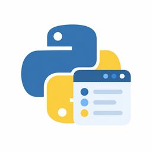

<p align="center">
  
</p>

# 🐍 PyDeck

**A home for your Python versions on Windows**

**English** · [简体中文](README.zh-CN.md)

PyDeck is a native **WinUI 3** companion for **Python Install Manager**. Browse interpreters, install a version, choose your default, and keep offline packages close at hand — in a desktop interface with **Windows Fluent** and **Material 3 Expressive** styles.

📦 **Release · 0.7.2** · 🪟 **Windows 11 x64** · 📄 **MIT**

## 📦 Download

Get the packages from [GitHub Releases](https://github.com/DM10cn/PyDeck/releases). Choose one installation format:

| Download | Purpose |
| --- | --- |
| `PyDeck-Setup-0.7.2-win-x64.exe` | Native offline installation and maintenance, including runtime preparation |
| `PyDeck-0.7.2-win-x64.msi` | Standalone per-user installer; prepare runtimes separately |
| `PyDeck-Dependencies-0.7.2-win-x64.exe` | Readiness checklist and official download links; does not install PyDeck |

For source, use GitHub's automatic **Source code (zip)** / **Source code (tar.gz)** links in Assets. Follow the [installation guide](docs/INSTALL.md) for dependencies, installer choices, and MSIX certificate trust.

**0.7.2** refines Material layouts and ripple interactions, adds a categorized settings workspace and About page, and improves native MSI installation and cached uninstall flows. See the [release notes](docs/RELEASE-0.7.2.md) and [installer interaction checks](docs/INSTALLER-CHECKS.md). This release provides **unsigned EXE/MSI files**, with no new MSIX or certificate; historical 0.7.1-fix files remain available separately.

New in **0.7.1-fix**: 🎨 separate Fluent and Material 3 Expressive presentations, wallpaper-based Monet colors, manual base colors and an optional two-color palette, plus a cancellable restart prompt for switching interface style. Material search fields, dropdowns, expanders, scrollbars, and refresh/operation progress now follow the selected design and colors. See [appearance](#-appearance-and-language), [feature status](docs/FEATURES.md), and the [color-engine source notes](docs/MONET.md).

The **0.7.0-fix** management features remain available: private build-Python preparation, build storage cleanup, runtime usage, and virtual-environment package / pip management. See the [management guide](docs/MANAGEMENT_070.md) and [historical performance notes](docs/PERFORMANCE_070.md).

Features introduced in **0.6.1** remain available: 🧰 virtual environments, 🌐 custom HTTPS installation sources, 📜 Shebang rules, 🔔 browser-based app update checks, inline Python settings, Python / variant / EAP icons, and database refresh. MSI uses full-package replacement upgrades while retaining settings and installer choices.

## ✨ What you can do

- 🐍 **See your Python installations** — version, publisher, architecture, executable path, and effective default
- 📥 **Find and install Python** — a stable recommendation, historical micros grouped by minor series, search, and remembered architecture / package-type / preview filters
- 📦 **Work offline** — download a portable PIM bundle on one computer and install it on another
- ⏳ **Follow an operation** — persistent stage progress and cancellation for installation, updates, and offline downloads
- 🛠️ **Manage a runtime** — update, uninstall, set the default, open a terminal or folder, and copy its path
- 🎨 **Make it yours** — separate Fluent and Material 3 Expressive interfaces, System / Light / Dark themes, Fluent Mica or Acrylic, and Material wallpaper / manual dynamic colors
- 🌏 **Choose your language** — English by default, plus Simplified Chinese, Traditional Chinese (Taiwan), and Japanese
- 🧰 **Recover missing dependencies** — open official runtime or Python Install Manager download pages, install the missing software yourself, then recheck or reconnect
- 🗂️ **Choose how to install** — MSI folder selection with Browse, optional desktop and Start menu shortcuts, an initial interface choice, and existing preferences retained during upgrades

New in **0.6.0**: verified operation results, PATH / alias diagnostics, PIM configuration with backup / restore, HTTP proxies with Windows Credential Manager, measured download bytes / speed / ETA, and interpreter health checks / PIM repair. See the [Python management guide](docs/MANAGEMENT.md). These additions are not in the published 0.5.1 installers.

See the [feature status and roadmap](docs/FEATURES.md) for implementation details and remaining acceptance work.

## 📋 Before you start

PyDeck targets **Windows 11 x64**. The full GUI needs **.NET Runtime 10 x64** and **Windows App Runtime**; the MSI / unpackaged GUI also needs **Visual C++ v14 x64**. Exact versions, official downloads, and format-specific requirements are maintained in the [installation guide](docs/INSTALL.md).

The native dependency window can open before those runtimes are installed. **Python Install Manager is needed to manage Python, but its absence does not block the GUI**: download it from the app's official link, install it, then reconnect. The standalone MSI and MSIX require separate runtime installation.

📦 **Offline Setup:** `PyDeck-Setup-0.7.2-win-x64.exe` can install missing runtimes from its embedded installers, then run MSI within the same setup flow. Compatible runtimes are skipped; dependencies-only mode prepares for a separate MSIX installation. The separate dependency checker only reports readiness and opens official download pages. See the [installation guide](docs/INSTALL.md); end users do not need an SDK.

Windows 10 support is deferred. Visual Studio and the build tools below are only needed when building from source.

## 🚀 Build and run

Use **Visual Studio 2026** with **WinUI application development**, the **.NET 10 SDK**, and **Windows SDK 26100**. The SDK baseline is pinned in `global.json`; NuGet dependencies have committed lock files.

The prerequisite launcher and native color engine also need the **MSVC x64/x86 build tools** component, including C++ headers and desktop libraries. MSBuild builds `PyDeck.Colors.dll` from pinned sources and copies it into the app output. Published output starts through `PyDeck.Launcher.exe`; the launcher statically links its C++ support library and imports only Windows system DLLs.

```powershell
git clone https://github.com/DM10cn/PyDeck.git
cd PyDeck
.\scripts\Build.ps1 -Checks -Publish
.\scripts\Run.ps1
```

You can also open `PimGui.slnx` in Visual Studio, select `PimGui.App`, and build the C# GUI for **x64**. Use the publish script above to include the C++ prerequisite launcher; it is built by script, not by the solution. The product is **PyDeck**, its GUI is `PyDeck.exe`, and the normal launch entry is `PyDeck.Launcher.exe`; `PimGui` remains an internal project name.

The development output is an **unpackaged, framework-dependent application** under `artifacts/`. Keep all published files together. See the [release workflow](docs/RELEASING.md) to build MSI and MSIX packages.

🧑‍💻 [Development guide](docs/DEVELOPMENT.md) · 🗺️ [Feature status](docs/FEATURES.md) · 🔐 [Security notes](SECURITY.md)

## 📦 Install Python offline

1. On a connected computer, open **Install Python → Online** and choose a version's **⋯ → Download offline package** action
2. Copy the complete generated folder, including `index.json` and ZIP files, to the offline computer
3. Open **Install Python → Offline → Choose folder**, select that folder, and install a version

Prepare Python Install Manager and all [runtime prerequisites for your installation format](docs/INSTALL.md) before taking the computer offline. This feature installs Python packages offline; it does not supply PyDeck's own runtime dependencies. Bundles produced by `pymanager install --download=<folder> <tag>` are also supported.

PyDeck requires a standalone local bundle with SHA-256 checksums and stages a verified copy before installation. A checksum checks integrity, not publisher identity, so use a trusted source. Missing or damaged packages stop the operation. See [Python's offline installation guide](https://docs.python.org/3/using/windows.html#offline-installs).

## ⏳ Progress and cancellation

The operation panel stays visible across pages. Official package downloads show measured bytes, smoothed speed, and ETA when reliable. Values below 1 MB use KB. Extraction percentages remain **approximate stage progress** derived from PIM output; unknown phases use an indeterminate bar. In Material, refresh and operation indicators use the current primary color over a tonal track; Fluent retains native progress styling.

You can stop Python installation, updates, and offline downloads. Stopping an installation requires confirmation and **may leave partial files**. PyDeck waits for the current process to exit and refreshes the installed list; it does not promise rollback. Python uninstallation cannot be cancelled mid-operation. These controls apply to Python operations inside PyDeck, not to the MSI / MSIX setup wizard.

## 🎨 Appearance and language

Fluent and Material 3 Expressive have separate navigation and component presentations. Fluent provides **Transparency effects: Use Windows setting / On / Off**, with a separate **Mica / Acrylic** choice. Windows accessibility, power, and hardware policies can still apply a solid fallback. Material uses opaque surfaces and rounded tonal controls.

Material defaults to local **desktop wallpaper** colors. You can instead apply a **custom base color**, and choose **Balanced**, **Expressive**, or **Two colors**. The native engine combines official MCU Celebi quantization and HCT/dynamic roles with the pinned AOSP wallpaper seed scorer, using the 2021 color specification. **Two colors** is PyDeck's `DualSource` extension: the first source shapes primary actions and backgrounds, and the second shapes secondary/tertiary accents. Wallpaper mode selects a second candidate when available; manual mode provides two pickers. This is not a full port of Google's CMF variant or newer color specifications. Wallpaper images stay local; only color seeds and a metadata hash are cached. See [implementation and source provenance](docs/MONET.md).

Changing **interface style** saves the choice and offers **Restart now** or **Later**. Restart now remains gray for **1.8 seconds** and stays unavailable while any task is active. Later keeps the current interface and tasks running; the saved style applies on the next launch. A rejected restart request displays a message. Theme, language, and explicitly applied colors do not require a restart. Automatic wallpaper changes wait while you are editing, then apply on a page change.

Language changes apply immediately and are saved. Documentation is maintained in **English and Simplified Chinese**; the application also supports Traditional Chinese (Taiwan) and Japanese. Raw PIM output and version identifiers remain unchanged.

## 🧪 Validation status

**0.7.2** passed compilation and 20 native installer check groups, including button callbacks with simulated external effects. Actual installation, repair, upgrade, uninstallation, and app smoke tests were not run. This does not constitute complete acceptance; see the [release details](https://github.com/DM10cn/PyDeck/releases/tag/v0.7.2).

Historical results, including **0.7.0-fix's 108 core checks and 26 GUI groups**, remain in [feature status](docs/FEATURES.md) and do not certify these new packages. Clean-machine deployment, certificate trust, text scaling, and external accessibility remain separate acceptance work.

## 🤝 Contributing

Issues and pull requests are welcome. Include the app version, Windows version, reproduction steps, and expected behavior. Remove personal paths, account details, credentials, and private package sources from logs before sharing them.

Keep public documentation in English and Simplified Chinese, keep the English page as the default, and update both versions when behavior changes. 🔐 Do not post secrets or sensitive vulnerability details in a public issue; see [Security](SECURITY.md).

## 📄 License and acknowledgements

PyDeck is licensed under the [MIT License](LICENSE). Third-party dependencies retain their own licenses.

PyDeck is an independent project and is not affiliated with or endorsed by the Python Software Foundation or Microsoft. Python names and logos are subject to the PSF's trademark policy; the MIT license does not grant third-party trademark rights. See [third-party notices](THIRD-PARTY-NOTICES.md).
