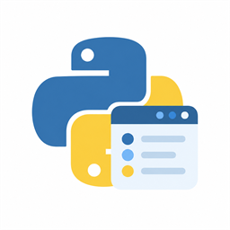

<p align="center">
  
</p>

# 🐍 PyDeck

**在 Windows 上，为你的 Python 版本安个家**

[English](README.md) · **简体中文**

PyDeck 是 **Python Install Manager** 的原生 **WinUI 3** 图形界面，支持查看解释器、安装版本、设置默认版本和管理离线包，并提供 **Windows Fluent** 与 **Material 3 Expressive** 两种界面风格

📦 **正式版 · 0.6.1** · 🪟 **Windows 11 x64** · 📄 **MIT**

## 📦 下载

从 [GitHub Releases](https://github.com/DM10cn/PyDeck/releases) 获取 **MSI**、**MSIX** 和 **独立依赖工具**，源码使用 Assets 中 GitHub 自动提供的 **Source code (zip)** / **Source code (tar.gz)** 链接。依赖要求、安装选项与 MSIX 证书信任步骤统一见 [安装说明](docs/INSTALL.zh-CN.md)

**0.6.1 新增**：🧰 虚拟环境、🌐 自定义 HTTPS 安装源、📜 Shebang 规则和 🔔 应用版本检查，新版入口使用默认浏览器打开 GitHub。Python 设置改为页内折叠，目录增加发行包类型筛选与小版本分组，Python 图标分别显示类型和 EAP 角标，底部可刷新本机与目录数据。MSI 使用完整包覆盖升级，保留设置和安装选项

## ✨ 可以做什么

- 🐍 **查看 Python 安装** — 版本、发行方、架构、可执行文件路径和实际默认版本
- 📥 **查找并安装 Python** — 稳定版推荐、搜索、架构筛选和可展开的特殊发行包
- 📦 **离线使用** — 在联网电脑下载 PIM 离线包，复制到另一台电脑安装
- ⏳ **查看操作进度** — 持续显示阶段进度，支持取消安装、更新和离线下载
- 🛠️ **管理解释器** — 更新、卸载、设为默认、打开终端或文件夹、复制路径
- 🎨 **调整外观** — Fluent / Material 3 Expressive、跟随系统 / 浅色 / 深色，以及 Fluent 专属的 Mica / Acrylic
- 🌏 **切换语言** — 默认英语，另有简体中文、繁体中文（台湾）和日语
- 🧰 **补齐运行依赖** — 打开运行时或 Python Install Manager 官方下载页面，手动安装后重新检查或连接
- 🗂️ **选择安装方式** — MSI 支持目录浏览、可选桌面和开始菜单快捷方式，升级时保留选择

**0.6.0 新增**：操作结果核验、PATH / 别名诊断、PIM 配置备份与恢复、使用 Windows 凭据管理器的 HTTP 代理、真实下载量 / 速度 / 剩余时间，以及解释器检查和 PIM 修复。使用方法见 [Python 管理指南](docs/MANAGEMENT.zh-CN.md)，已发布的 0.5.1 安装包不包含这些新增功能

详细实现情况与待验收项目见 [功能状态与计划](docs/FEATURES.zh-CN.md)

## 📋 使用前准备

PyDeck 面向 **Windows 11 x64**。完整 GUI 需要 **.NET Runtime 10 x64** 和 **Windows App Runtime**；MSI / 非打包 GUI 还需要 **Visual C++ v14 x64**。具体版本、官方下载来源与不同安装格式的要求统一见 [安装说明](docs/INSTALL.zh-CN.md)

原生依赖窗口可在这些运行时尚未安装时打开。**管理 Python 需要 Python Install Manager，但缺少它不会阻止打开 GUI**：可从应用中的官方链接下载，手动安装后重新连接。PyDeck 不内置或静默安装这些依赖

Windows 10 支持暂缓，下面的 Visual Studio 和编译工具仅供源码构建使用

## 🚀 构建与运行

使用 **Visual Studio 2026**，安装 **WinUI 应用程序开发**、**.NET 10 SDK** 和 **Windows SDK 26100**。SDK 基线见 `global.json`，NuGet 依赖包含锁定文件

编译原生依赖启动器还需要 **MSVC x64/x86 编译工具**组件，包括 C++ 标准头文件与桌面库。发布目录通过 `PyDeck.Launcher.exe` 启动，C++ 基础库静态链接，仅导入 Windows 系统 DLL

```powershell
git clone https://github.com/DM10cn/PyDeck.git
cd PyDeck
.\scripts\Build.ps1 -Checks -Publish
.\scripts\Run.ps1
```

也可以在 Visual Studio 中打开 `PimGui.slnx`，选择 `PimGui.App`，使用 **x64** 构建 C# GUI。若要包含 C++ 依赖启动器，请使用上面的发布脚本；该部分由脚本编译，不在解决方案构建中。产品名为 **PyDeck**，GUI 为 `PyDeck.exe`，正常启动入口为 `PyDeck.Launcher.exe`；`PimGui` 仅为内部项目名称

开发输出位于 `artifacts/`，是**依赖外部运行时的非打包应用**，使用时请保留输出目录中的所有文件。MSI 与 MSIX 的构建方式见 [发行流程](docs/RELEASING.zh-CN.md)

🧑‍💻 [开发指南](docs/DEVELOPMENT.zh-CN.md) · 🗺️ [功能状态](docs/FEATURES.zh-CN.md) · 🔐 [安全说明](docs/SECURITY.zh-CN.md)

## 📦 离线安装 Python

1. 在联网电脑打开 **安装 Python → 在线**，从版本的 **⋯ → 下载离线包** 操作创建离线包
2. 将生成的整个文件夹复制到离线电脑，包括 `index.json` 和 ZIP 文件
3. 打开 **安装 Python → 离线 → 选择文件夹**，选择离线包目录并安装

断网前请准备好 Python Install Manager 及[所选安装格式需要的全部运行时](docs/INSTALL.zh-CN.md)。此功能离线安装的是 Python 包，不提供 PyDeck 自身的运行依赖；也支持 `pymanager install --download=<folder> <tag>` 生成的离线包

PyDeck 接受包含 SHA-256 校验值的独立本地离线包，并在安装前创建经过验证的副本。校验值只能验证完整性，不能证明发布者身份，请使用可信来源；缺包或文件损坏时会停止操作。参见 [Python 离线安装指南](https://docs.python.org/3/using/windows.html#offline-installs)

## ⏳ 进度与取消

操作面板在切换页面后仍然可见。0.6.0下载官方包时显示真实字节数、平滑速度和可靠时的剩余时间，不足 1 MB 显示 KB。解压仍使用 PIM 输出中的**阶段约数进度**，未知阶段使用不定进度条；已发布的 0.5.1 下载进度也使用约数

Python 安装、更新和离线下载支持停止。停止安装需要确认，且**可能留下部分文件**。PyDeck 会等待当前进程退出并刷新安装列表，不承诺自动回滚；Python 卸载不支持中途取消。这里指 PyDeck 内的 Python 操作，不是 MSI / MSIX 安装向导

## 🎨 外观与语言

Fluent 提供 **透明效果：使用 Windows 设置 / 开 / 关**，并可单独选择 **Mica / Acrylic**。Windows 的辅助功能、电源或硬件策略仍可能使背景回退为实色。Material 3 Expressive 使用实色表面

语言切换即时生效并保存。文档维护**英语和简体中文**两个版本，应用另支持繁体中文（台湾）和日语。PIM 原始输出及版本标识保持原文

## 🧪 验证状态

0.5.1 预览版已通过核心与原生检查、已安装 MSI 的 GUI 检查，以及 MSIX 开发注册 / 激活检查，也已验证 MSI 目录浏览、快捷方式选项、修复和升级

0.6.0新增一次性 Windows Sandbox 生命周期验收，覆盖 PIM 升级、Python 真实更新、修复、取消、默认切换、卸载和离线重装。干净机器 GUI 部署和 MSIX 正式证书信任安装路径仍是单独的待验收项目。已完成与待验收项目统一记录在[功能状态表](docs/FEATURES.zh-CN.md)，运行检查的方法见[开发指南](docs/DEVELOPMENT.zh-CN.md)

## 🤝 参与贡献

欢迎提交 Issue 和 Pull Request，请附上应用版本、Windows 版本、复现步骤和预期行为。分享日志前，请移除个人路径、账号信息、凭据和私有软件源

公开文档仅维护英语和简体中文，英语为默认页面；行为变化时请同步更新两个版本。🔐 请勿在公开 Issue 中发布密钥或敏感漏洞细节，参见 [安全说明](docs/SECURITY.zh-CN.md)

## 📄 协议与致谢

PyDeck 使用 [MIT 协议](LICENSE)，第三方依赖保留各自的许可证

PyDeck 是独立项目，与 Python Software Foundation 或 Microsoft 不存在隶属或背书关系。Python 名称及标志受 PSF 商标政策约束，MIT 协议不授予第三方商标权利，详见 [第三方声明](docs/THIRD-PARTY-NOTICES.zh-CN.md)
